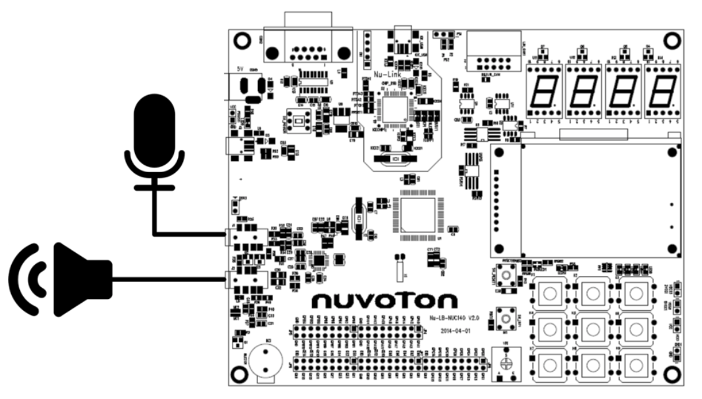

# Audio Recording and Playing using WAU8822

This project contains an example of how to use the WAU8822 chip on Nuvoton NU-LB-NUC140 development board as recorder and player.

## Requirements and Project base

### IDE & Drivers

- [Keil uvision MDK-ARM 5]([http://www2.keil.com/mdk5/](http://www2.keil.com/mdk5/))
- [Nu-Link Keil Driver](https://www.nuvoton.com/hq/support/tool-and-software/development-tool-hardware/programmer/?__locale=en)

### External input/output

- Line-in 3.5mm aux connection connected to microphone,
- Line-Out 3.5mm aux connection connected to speaker.
- SD-Card attached to the back of the board, please make sure It set to FAT32.

### Dependencies

- Nuvoton NU-LB-NUC140 base library. (NUC1xx & NUC1xx-LB_002)
- adpcm4bit by Nuvoton.
- librf-dongle by Nuvoton.
- [FatFs by ChaN](http://elm-chan.org/fsw/ff/00index_e.html)

### Nuvoton NU-LB-NUC140 board setup

## Usage

This project shows an example of using the WAU8822 chip as Audio recorder and player. First, please setup all project requirements and dependencies and then you can use WAU8822 library files (`WAU8822.c & WAU8822.h`).

The main program is an example of a tape recorder. When keypad number `2` pressed the board will start to record audio from line-in aux connection, In this method the audio converted and saved in `wav` format on the attached sdcard using FatFs library. When the keypad number `1` pressed then it will start to play the recorded audio to line-out aux connection, In this case, it will read and play the `wav` file saved in the sdcard. In addition, the LCD screen is also used for showing the recorded time & user information.

In order to communicate with WAU8822 chip those lines are in use: `I2S RX(J1)`, `I2S TX(J2)`, `UART0` & `I2C`. The interface protocol with WAU8822 chip is I2S. 